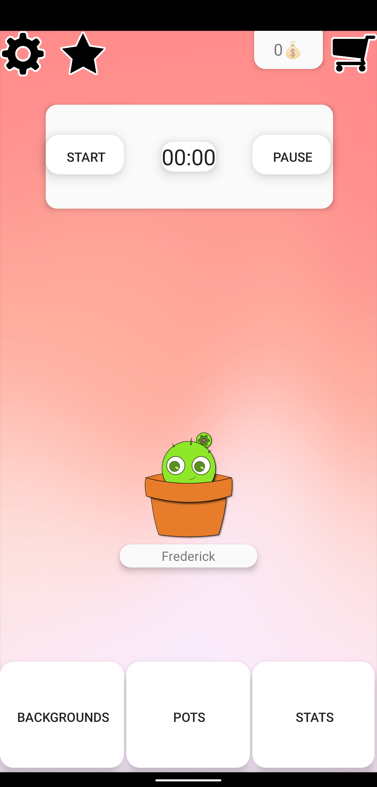
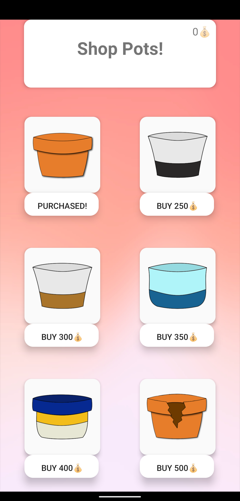
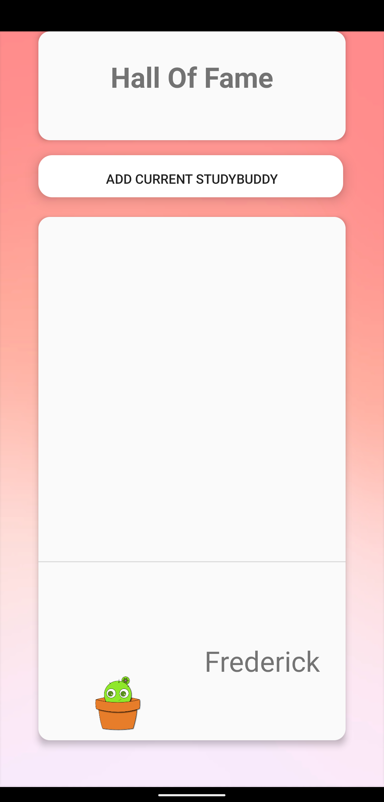
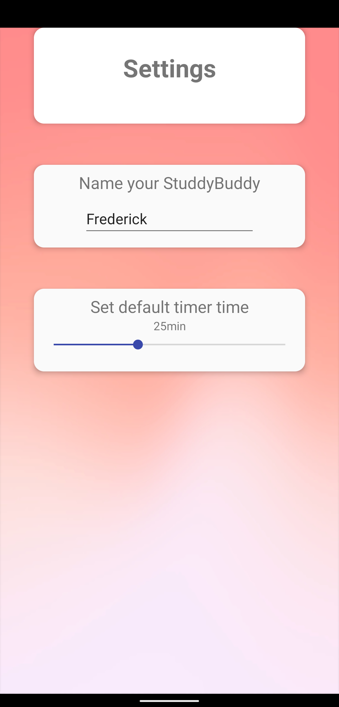

# StudyBuddy
A game that motivates you to study

![alt text][logo]

[logo]: ./app/src/main/res/drawable-v24/study_buddy_icon.png "Icon of StudyBuddy"

# Project Overview

By Nina Fritz & Florian Wieland

Version 1.1

View in [Google Play](https://play.google.com/store/apps/details?id=com.wieliFritz.studybuddy) Store

Required Software: Android Nougat (7) or higher

## General Infos & Idea

StudyBuddy is an Android exclusive App that aims to motivate Students to Study. The game features a timer which can be used to track study sessions, and a tamagochi-like character which the player needs to take care of.

This App is completely custom-coded in Kotlin. Every asset used in this App is either custom-designed or DRM-free.

### Timer
The built-in timer can be used to track study sessions (of course one could also use it to track other things like doing housework etc.). While the timer is active, the player will gain coins every ten seconds which can be spend in the shop to customize the active StudyBuddy. The timer can be customized to start from any value between 5 and 60 minutes.

### StudyBuddy Character
The StudyBuddy character is a digital pet which can be personalized by the player and evolves over time. All three stages of evolutions can be customized to have a name and a pot, the latter of which can be bought from the store. To keep players motivated, the StudyBuddy can also be moved into the Hall Of Fame, which will reset the StudyBuddy.

### Shop
Players can buy pots and backgrounds in the shop. The items can be bought using the in-game currency which can be gained with tracked study-time from the timer - which will grant 1 coin every ten seconds.

Pots are the 'houses' of StudyBuddies and once purchased can be equipped to every StudyBuddy, no matter the stage of evolution or name. There are a total of six pots to choose from.

Backgrounds, once purchased, can change the Background of every Screen in the App when equipped. There are a total of six backgrounds to choose from.

Pots and backgrounds will stay purchased even when a StudyBuddy is moved to the Hall Of Fame. 

### Hall Of Fame
The Hall Of Fame aims to offer an unlimited objective for the player, as once the final stage of evolution of a StudyBuddy is reached, the player may longer see any progress and thus lose motivation. To prevent this, the Hall Of Fame is an optional 'reset-button' which resets the StudyBuddy to the first stage of evolution and the default name.

Of course the current StudyBudddy wil not be lost, but forever memorized in the Hall Of Fame along with its name and active pot. The Hall Of Fame is accessible from minute one, meaning that even StudyBuddies that haven't evolved can be moved into the Hall Of Fame

### Settings
In the settings Page, players can currently do two things:
- Rename the active StudyBuddy to a custom String
- Change the Timer time to a value (in minutes) between 5 and 60 Minutes

### Stats
The Stats Page displays the following statistiks for the player:
- Total Time Learned 
- Sessions completed
- Money earned
- Average sesssion length
- Items bought
- Hall Of Fame Entries

### Supported Languages
The following languages were translated by hand
- English
- German
- German (Austrian)
- German (German)

### Technologies used
- Shared Preferences -> to store all kinds of information which is needed to save eg purchased items or StudyBuddy names...
- Chronometer (down) -> this requires API Level 24. Needed for the timer.
- Kotlin -> The App is a pure Kotlin App.
- Backup -> This App aims to respect privacy. In order to ensure that players will not lose progress when switching devices, this app uses Shared Preferences. These Shared Preferences are stored locally, however are automatically backuped through the Google Play Store backup function.

# Installation
To install this App on an Android Smartphone go the following link and click install: <https://play.google.com/store/apps/details?id=com.wieliFritz.studybuddy>

Please note that an Android Version of 7 or higher is required to run this App.

# Contribute
Feel free to contribute to this app if you like. To do this we recommend using Android Studio which can be downloaded for free here: <https://developer.android.com/studio>
Please make sure to not violate any copyright when adding assets or other external ressources

# Future Goals
The following will be fututre additions to make the game even more interesting and effective
- More Pot designs
- More Background designs
- Other items for customization (like sunglasses etc.)
- Additional steps of evolution
- Better graphical display of Stats (Bar charts etc.)
- Additional StudyBuddys (not just cacti, but also for exammple Sunflowers, ...)
- More support for other languages
- Interaction with StudyBuddy (Animations)
- Playing games with StudyBuddy

# Privacy
<https://github.com/wieli99/StudyBuddy/blob/master/privacy.md>

# License
<https://github.com/wieli99/StudyBuddy/blob/master/License>
